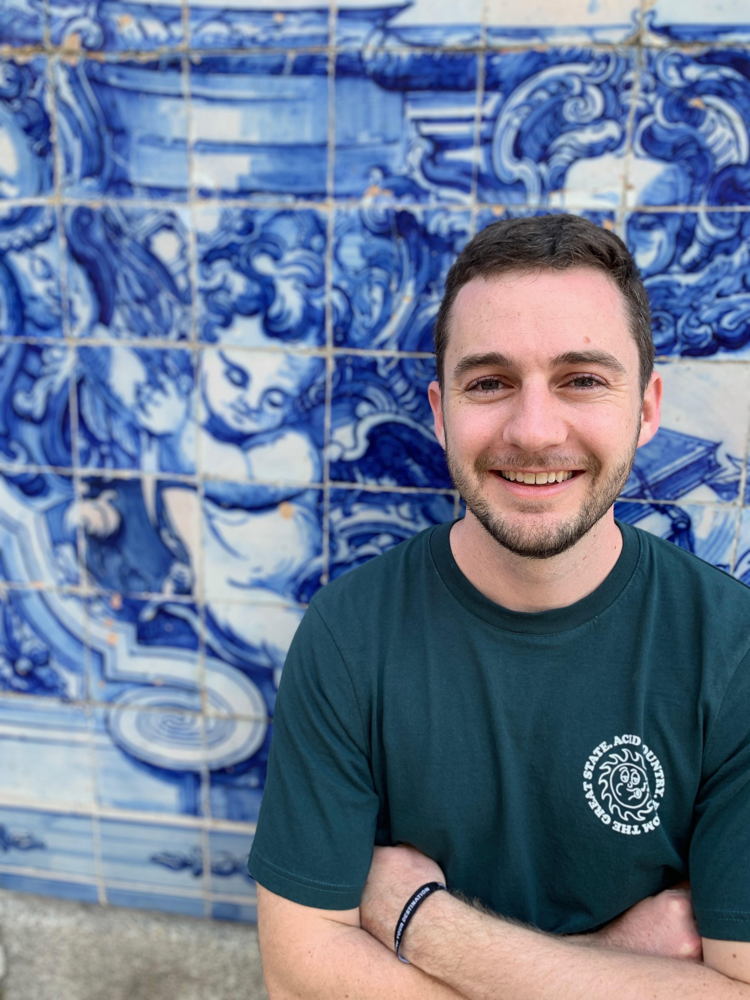

[CV](Brandon Cunnane CV.pdf)
*Brandon Cunnane  
Medical Physics Masters Student  
San Diego State University*

### Project Links
1. [Muscle fiber identification from DTI eigenvectors](https://bcunnane.github.io/DTI_fibers/)
2. [Muscle fiber strain determined from motion tracking via VEPC and Dynamic MRI](https://bcunnane.github.io/fiber_tracking/)

Stethoscopes, thermometers, and electrocardiographs. These simple tools are essential to modern medical practice but would not exist without research applying technical knowledge to human health. This is why biomedical research inspires me. It offers the chance to develop the scientific knowledge needed for the next breakthrough in diagnosing and healing sick people. Four years as a biomedical engineer at Abbott Laboratories working with another great medical achievement, magnetic resonance imaging (MRI), inspired me to attend graduate school. I am amazed by the highly-detailed internal images MRI provides without requiring radiation dose or incisions. Additionally, I enjoy growing my technical skills working through the math and programming challenges presented by MR image processing and analysis.

My research is advised by **Professor Usha Sinha** and studies the effects of sarcopenia, or muscle loss with age. This investigation compares the muscle fiber strain in the medial gastrocnemius (MG) muscle of young and old subjects. My project is a collaboration between San Diego State and UC San Diego (UCSD), and data was collected at UCSD’s Radiology Imaging Laboratory in a 1.5T GE scanner with the subject's dominant leg fixed in a foot pedal fixture. This investigation (1) used **diffusion tensor imaging (DTI)** data to determine representative muscle fibers and (2) used **velocity encoded phase contrast (VEPC)** for **dynamic imaging** of these fibers’ motion compared to the force read by the foot pedal.

> *Brandon Cunnane, San Diego State University*
