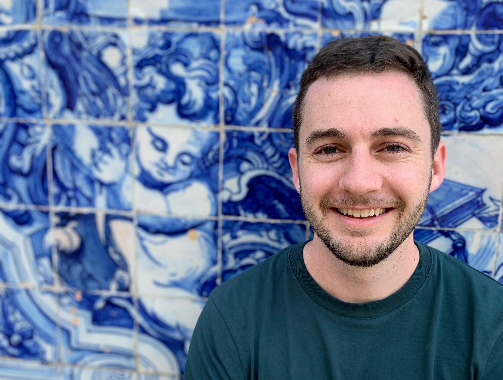

*Brandon Cunnane  
Medical Physics Masters Student  
San Diego State University*  
[CV](Brandon Cunnane CV.pdf)

### Project Links
1. [(a) Muscle fiber identification from DTI eigenvectors](https://bcunnane.github.io/DTI_fibers/)  
[(b) Muscle fiber strain determined from motion tracking via VEPC and Dynamic MRI](https://bcunnane.github.io/fiber_tracking/)
2. [Fiber aligned strain & strain rate](https://bcunnane.github.io/FAS/)
3. [DICOM processing for Siemens CS 4D Flow sequence](https://bcunnane.github.io/CS_4D_flow/)

Stethoscopes, thermometers, and electrocardiographs. These simple tools are essential to modern medical practice but would not exist without technical research applied to human health. This is why biomedical research inspires me. It offers the chance to develop the scientific knowledge needed for the next breakthrough in diagnosing and healing sick people. Working for four years as a mechanical engineer at Abbott Laboratories exposed me to another great medical achievement, magnetic resonance imaging. My role at Abbott was to evaluate pacemaker MRI safety, which included performing tests with scanners at a nearby hospital. Through this work, I met several MR researchers and was fascinated by their highly technical projects. These interactions inspired me to enroll in graduate school and conduct research of my own. After developing my research skills at San Diego State (SDSU), I am excited to continue my education and pursue a PhD.

My interest in MRI flourished in graduate school while using it to study sarcopenia, muscle loss with age, in the medial gastrocnemius (MG) muscle of the human calf. My work is advised by Professor Usha Sinha of SDSU and is in collaboration with Professor Shantanu Sinha of UC San Diego Radiology. The following projects of mine were recently submitted as abstracts to ISMRM 2022: **(1a)** automatically determining representative muscle fibers from DTI data and **(1b)** tracking their motion with dynamic VEPC imaging to find their length, strain, and angle while contracting; **(2)** developing a method to align strain in the DTI eigenvector directions; and **(3)** demonstrating that the Siemens CS 4D FLow sequence can be used for muscle strain analysis. I was the first author on abstracts 1ab and 2.

> *Brandon Cunnane, San Diego State University*
