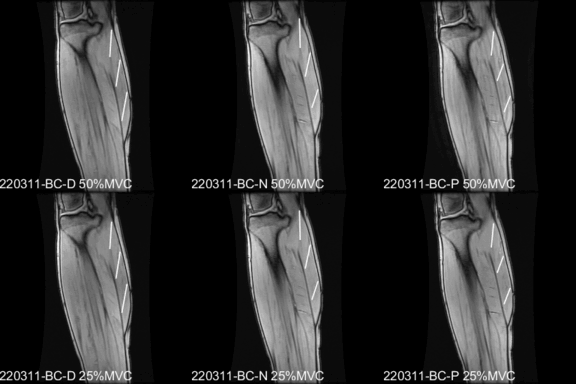

[LinkedIn](https://www.linkedin.com/in/brandoncunnane/) • [Resume](Brandon_Cunnane_Resume.pdf) • brandon.cunnane@gmail.com  

I recently graduated from San Diego State University with an applied physics master's degree focused on utilizing radiation in medical diagnosis and treatment. My research projects conducted at UC San Diego's Radiology Imaging Laboratory used quantitative MRI image data analysis to study human muscle physiology. This work resulted in two presentations at the annual MRI conference, ISMRM, and a pending paper submission to the Journal of MRI. I am interested in software development and data analysis and hope to continue developing impactful solutions to intersting problems in the future. 

----

### [Research: Muscle Fiber Strain Mapping at Different Ankle Angles](https://bcunnane.github.io/fiber-tracking-py/)
a. Automated muscle fiber identification in MRI images [GitHub]
- Identified muscle regions of interest and created masks using Python (opencv)
- Calculated fiber lengths and directions from MRI image data with Python (NumPy)

b. Executed data analysis of muscle fiber contraction at different foot positions [GitHub]
- Processed and organized MRI DICOM datasets using Matlab
- Computed fibers’ length, strain and angle during contraction using Python (NumPy)
- Analyzed statistics (ANOVA, t-tests, and nonparametric) with Python (SciPy, pandas) 
- Visualized results in plots and animations using Python (Matplotlib)

----

### [Research: Aligning muscle strain in the direction of the muscle fibers](https://bcunnane.github.io/muscle-fiber-aligned-strain/)
- Wrote MATLAB script to project each voxel’s 3D strain tensor in the muscle fiber direction
- Visualized strain results as colormaps overlaid on muscle images

