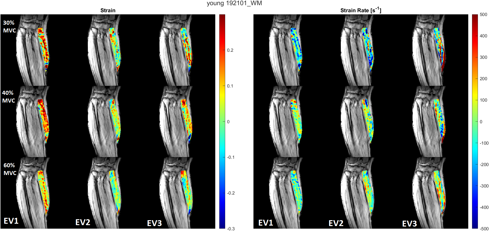

# About
[Email](brandon.cunnane@gmail.com) • [LinkedIn](https://www.linkedin.com/in/brandoncunnane/) • [Resume](Brandon-Cunnane-Resume.pdf)

I am a recent graduate in medical physics graduate from San Diego State University researching muscles using MRI image processing. I am interested in software programming and investigations using large datasets.

# [Research: Tracking muscle fiber motion in MRI images](https://bcunnane.github.io/fiber_tracking/)
- Built MATLAB function to automatically identify fibers from diffusion MRI data
- Created MATLAB MRI DICOM processing script to analyze muscle fiber contraction

# [Research: Aligning muscle strain in the direction of the muscle fibers](https://bcunnane.github.io/FAS/)
- Projected each voxel’s 3D strain tensor on the corresponding diffusion eigenvectors
- Increased computation speed by reshaping the voxel arrays and utilizing vectorization
- Visualized strain results as colormaps overlaid on muscle images

